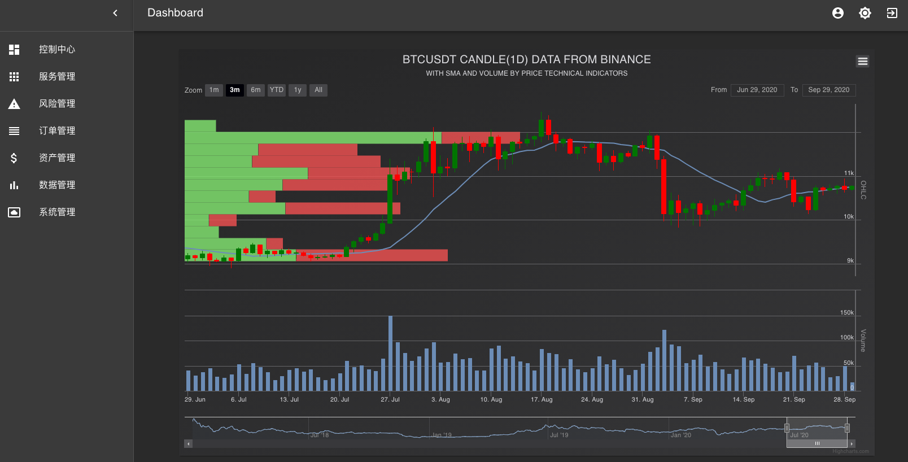

### Hi there 👋

<!--
**TheNextQuant/thenextquant** is a ✨ _special_ ✨ repository because its `README.md` (this file) appears on your GitHub profile.

Here are some ideas to get you started:

- 🔭 I’m currently working on ...
- 🌱 I’m currently learning ...
- 👯 I’m looking to collaborate on ...
- 🤔 I’m looking for help with ...
- 💬 Ask me about ...
- 📫 How to reach me: ...
- 😄 Pronouns: ...
- ⚡ Fun fact: ...
-->
Hi,

热爱加密货币量化的你，

欢迎来到thenextquant开源的主页，我们近期删除了thenextquant github的仓库，因为我们的精力有限，目前专注自有资金的量化，无暇顾及其它，所以我们直接关闭了该项目。
但在我们内部，基于thenextquant的量化交易系统将一直运行下去。

加密货币世界经过三年的洗礼，今天已经发展到了一定的规模，在这期间出现了很多好的量化工具和量化团队：
### 工具
1. vn.py
2. fmz
3. 1token
4. Gekko
5. ccxt
6. goex
7. thenextquant(面向机构)/aioquant(面向个人)
...

### 团队
1. Alameda Research
2. Kronos Research
3. Amber
4. 很多机构背后的团队：Pantera、Paradigm、币信、贝宝
5. DigitalRoadGroup(thenextquant是我们推出的)
...

2017～2020币圈经历了太多的起伏，很多老朋友已经消失不见，又有很多新工具和团队层出不穷，大家一起努力，不断促进币圈欣欣向荣；
DigitalRoadGroup的初衷是为了更好的经营自营资金，所以我们今年做了精简，专注量化，其它对外合作和开放暂时忽略。

### next？
DigitalRoadGroup将继续深耕二级市场量化。
最后来张内部不涉密的thenextquant截图：

我们江湖再见。
